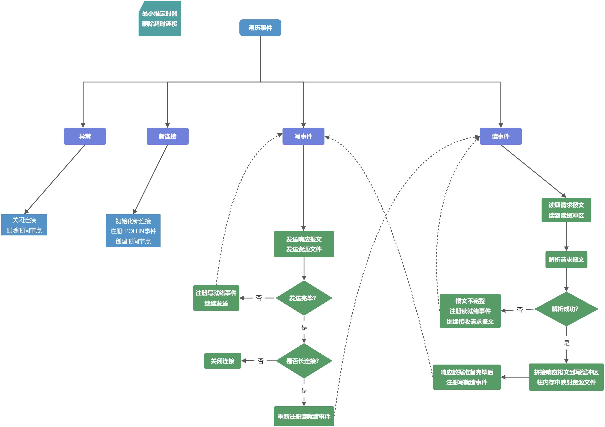

## WebServer

高性能并发服务器，由`webbench`测试可达到上万QPS；

**【关键词】**

**C++11、IO多路复用技术Epoll、Reactor高并发模型、线程池、异步日志系统、最小堆定时器、数据库连接池、有限状态机、自增长缓冲区、单例模式、自定义Json解析器**

---

- [WebServer](#webserver)
- [工作流程](#工作流程)
	- [流程图](#流程图)
- [线程池模块](#线程池模块)
- [缓冲区模块](#缓冲区模块)
- [Epoll模块](#epoll模块)
- [HTTP连接模块](#http连接模块)
- [HTTP解析模块](#http解析模块)
- [HTTP响应模块](#http响应模块)
- [定时器模块](#定时器模块)
- [日志模块](#日志模块)
- [阻塞队列模块](#阻塞队列模块)
- [MySQL连接池模块](#mysql连接池模块)
- [Json解析模块](#json解析模块)
- [WebServer模块](#webserver模块)
- [参考及致谢](#参考及致谢)

---

> 相对于[旧版](https://github.com/zyue2022/WeakServer)改变很大！

## 工作流程

1. 本服务器项目采用的是**同步I/O**(`epoll_wait`)实现`Reactor`事件处理模式；
2. 主线程负责监听文件描述符上是否有事件发生、接受新连接，工作线程负责读写数据，处理客户请求；
3. 工作流程是：主线程往 epoll 内核事件表中注册 **监听socket** 上的读就绪事件，而后调用 epoll_wait 等待 socket 上的事件发生，如下是可能事件类型：

- 若是新连接，主线程就往 epoll 内核事件表中注册该 socket 上的读就绪事件；

- socket 上是错误事件时，主线程就关闭该连接；
- socket 上是读事件时， 主线程则将**读任务**放入任务队列，睡眠在请求队列上的某个工作线程被唤醒，它从 socket 读取数据，并处理客户请求(解析HTTP报文，生成HTTP响应)，然后往 epoll 内核事件表中注册该 socket 上的写就绪事件；
- socket上是写事件时，主线程将**写任务**放入任务队列，睡眠在请求队列上的某个工作线程被唤醒，它往 socket 上写入响应报文，若是长连接就再次注册该 socket 上的读就绪事件，否则关闭连接；

### 流程图



---

## 线程池模块

- 池是一组资源的集合，服务器事先初始化好一组线程，即创建好线程池，这称为静态资源；
- 当服务器运行的时候，需要处理时就从池中取出一个线程，用完后还回去，无需动态申请和销毁资源，是一种以空间换时间的概念；
- 在构造函数中创建一组线程，用**lambda表达式**这种可调用对象作为子线程的工作函数，并设置**线程分离**；
- 使用**互斥量**和**条件变量**保证线程同步，需要运行的任务装载在一个队列中，即**任务队列**；
- 任务就是**函数模板对象**，类中有一个加入任务的模板成员函数`addTask`，每加入一个任务，唤醒一个线程；
- 子线程的工作逻辑其实就是从任务队列中取出任务然后执行它，若队列为空就休眠等待直到被唤醒；
- 还可以拓展的是：添加一个容器来装载各子线程、限制任务队列中最大任务数量；

## 缓冲区模块

- 利用`vector<char>`实现的动态增长的缓冲区，用来保存数据以及读写数据；
- 一个缓冲区对象主要包括3个部分：已读取段、未读取段、未写入段；

```c++
		  已读取段	    未读取段	  未写入段
缓冲区：++++++++++++++-------------xxxxxxxxxxxxx
    				 ^			  ^			   ^
    			   读指针		  写指针	   容器结尾处
```

- 自动扩容机制是比较即将写入缓存的数据大小是否小于**已读段加上未写段**的大小，如果满足则将**未读段**移动到最左边，否则重新申请更大的内存；
- 缓冲区从`sockfd`读取数据时采用**分散读**`readv`的方式，一块是指向当前缓冲区，另一块是辅助字符串防止缓冲区装不下，如果装不下后序再扩容缓冲区，然后合并到缓冲区中；
- 缓冲区往`sockfd`发送数据时直接调用`write`写入当前缓冲区中**未读取段**的数据；
- 缓冲区对应操作有：读取数据、返回读写位置、返回各个段信息、写入数据；

## Epoll模块

- 用于初始化`epoll`实例，便于管理；
- 功能是在epoll实例中增、删、改socket文件描述符及其监听事件类型；

## HTTP连接模块

- 每个HTTP连接对象表示一个客户端连接的各种**属性**，及其操作方法(**读、处理、写**)；
- 静态成员变量有：连接用户数、资源目录、epoll触发模式；
- 其它成员变量是：连接地址信息、socket文件描述符、连接是否关闭、读写缓冲区(自定义的buffer对象)、HTTP解析类对象、HTTP响应类对象；
- 主要操作方法有：初始化每个客户端连接、接收请求信息、发送响应信息、关闭连接；
- 简而言之，HTTP连接类对象就是用来接收请求然后回送响应，请求的解析和响应的生成是交给解析类对象和响应类对象去执行的；
- 读取请求数据是直接read客户端连接的socket文件描述符，读到**读缓冲区**里面；
- 请求的解析是调用解析类对象的成员函数，解析结果交给响应类对象去制作响应报文；
- 发送响应数据是采用**聚集写**`writev`的方式，在一次函数调用中写多个非连续缓冲区，并且再循环里面调整区块一与区块二的基址和长度，区块一对应**写缓冲区**，区块二对应客户端请求的**资源文件**，区块的基址及长度由响应类对象的返回结果配置；

## HTTP解析模块

- HTTP解析类对象用来解析**读缓冲区**中的HTTP请求报文，支持解析GET和POST请求；
- 采用了**正则表达式**和**有限状态机**来解析；
- 有限状态机是逻辑单元内部的一种高效编程方法，报文的每种数据类型字段可以映射为逻辑单元的一种执行状态，可以根据它来编写相应的解析逻辑，并转移到相应状态继续解析；
- 一个类对象包含：当前解析状态(枚举变量)、协议版本、HTTP请求方法(GET或POST)、请求资源路径、请求头、请求体、是否长连接等等；
- 请求体和请求体的信息采用**有序容器**`<key:string, value:string>`记录；
- 一个客户端连接可能有多次请求(**长连接**)，所以需要保存上次解析状态，用以指示是否为新的HTTP请求，当上一次的请求为完成状态时，会再次初始化解析类对象，以重新开始解析一个HTTP请求；
- 如果是GET请求，就不会解析**请求体**，如果是POST请求，还要从请求体中解析出账户与密码，然后MySQL连接池取出一个连接，调用API执行SQL语句，分别处理登录和注册的情况；
- 解析类对象中成员函数由HTTP连接类对象调用，读缓冲区作为主体解析函数的引用形式的形参传入；

## HTTP响应模块

- HTTP响应类对象负责根据解析结果，拼接响应报文到**写缓冲区**中；
- 使用了**哈希表**方便组装需要返回的状态码、头部字段信息；
- 成员变量有：请求资源文件(发送文件)的路径、是否长连接、状态码、内存映射区、文件信息；
- 操作方法有：往写缓冲区添加状态行、报文头部、报文正文(资源文件)；
- 资源文件通过**内存映射**方法映射到内存中，提高速度，当然会检查文件是否存在以及权限；
- 响应类对象中成员函数也由HTTP连接类对象调用，写缓冲区作为响应制作函数的引用形式的形参传入，如果有请求资源文件，还会返回文件映射在内存中的地址给连接类对象；

## 定时器模块

- 每个连接对应一个`TimeNodo`节点，里面封装了超时时间、回调函数等信息；
- 采用最小堆数据结构管理所有连接的超时信息，即维护一个**最小堆定时器**；
- 最小堆是采用`vertor<TimeNode>`数组实现的，堆顶元素就是最先超时的连接；
- 数组下标从0开始，0下标即对应堆顶节点，对于堆中某一节点，令它在数组中下标为`k`，则左子节点为`2*k + 1`，右子节点为`2*k + 2`，父节点为`(k - 1) / 2`；
- 插入节点时，插入到数组中的最后一个节点的后面，然后与该节点的父节点比较大小，如果插入的元素小于父节点元素，那么与父节点交换位置。重复上述步骤直到大于父节点元素或者到达堆顶。该过程叫做**上浮**，即插入时上浮；
- 移除节点时，将该节点与末尾节点交换，然后当前节点(之前的尾部节点)与子节点中的较小者比较，如果当前节点大于较小子节点，那么与较小子节点交换位置，重复上述步骤直到小于较小子节点或者到达倒数第二个节点为止。最后再删除末尾节点。该过程叫做**下沉**，即移除元素时下沉;
- 最小堆定时器的操作有：添加节点、删除所有超时节点(断开超时连接)、调整节点的过期时间；

## 日志模块

- 日志模块用于同步或异步记录服务器运行信息，具有按天分类，超行分类功能；
- **同步日志**是日志写入函数与工作线程串行执行，由于涉及到I/O操作，当单条日志比较大的时候，同步模式会阻塞整个处理流程，服务器的并发能力将有所下降；
- **异步日志**是将所写的日志内容先存入阻塞队列，写线程从阻塞队列中取出内容，写入日志；
- 异步日志用到了**阻塞队列**，还有**单例模式**，保证日志类对象只有一个实例对象，采用**局部静态变量懒汉模式**的方法实现；
- 日志有4个级别可选，分别是DEBUG、INFO、WARN、ERROR，分别对应级别0~3，比如设置级别为0时每个级别的信息都记录，设置为3时只记录错误信息；
- 成员变量有：是否开启日志记录、是否开启异步、日志文件路径、行数、时间、阻塞队列的智能指针、异步写入线程、自定义缓冲区，是否启用异步写入由阻塞队列的大小判断，如果阻塞队列大小不为0就是异步写入；
- 写入函数中将日志数据格式化并添加到我们**自定义的缓冲区**对象，若是同步写入就直接将缓存区中数据写入到磁盘日志文件，若是异步写入则调用生产者将其加入到阻塞队列，由写线程调用消费者负责写入到磁盘文件；
- 日志的格式用到了可变参数列表，`fputs`是将字符串写入流，FILE对象标识了要被写入字符串的流，`fflush`是强制将**系统缓冲区**数据刷新进参数指定的流中，防止数据丢失;
- 统一使用宏定义`LOG_BASE`写日志，宏中由单例模式的`instance`取得日志类对象实例的引用，再由其调用写入函数；
- 日志文件保存在工作目录的log文件夹，文件夹和日志文件如果不存在会自动创建；

## 阻塞队列模块

- 封装生产者-消费者模式，配合日志模块异步运行时使用；
- 对于**生产者-消费者**模型，以多线程为例，生产者线程与消费者线程共享一个缓冲区，其中生产者线程往缓冲区中push内容，消费者线程从缓冲区中pop内容；
- 为了实现线程间数据同步，将生产者-消费者模型进行封装，其中**共享缓冲区**采用队列`queue<string>`实现，称为**阻塞队列**，有最大缓存容量限制；
- 使用**互斥量**、**条件变量**(生产者条件变量、消费者条件变量)保证线程安全，工作线程将要写的内容push进队列，写线程从队列中pop出内容，
- 类的成员函数中，pop和push函数由Log类中调用，flush函数用于唤醒一个消费者；

## MySQL连接池模块

- 类似线程池，在程序初始化时创建多个数据库连接，并把他们集中管理，保证较快的数据库读写速度；
- 具体就是工作线程从数据库连接池取得一个连接，访问数据库中的数据，访问完毕后将连接交还连接池；
- 本项目中使用局部静态变量懒汉方法**单例模式**和**队列**创建数据库连接池，实现对数据库连接资源的复用；
- 项目中的数据库模块分为两部分，其一是数据库连接池的定义，其二是利用连接池完成登录和注册的校验功能，**校验逻辑**其实是在**HTTP解析类**中进行的；
- 数据库连接池的功能主要有：初始化、获取连接、释放连接、销毁连接池；
- 运用RAII机制封装了一个`connRAII`类，用于从MySQL连接池取出连接，连接就通过析构函数中自动回池；
- 因为连接总数一定且有限，所以使用**互斥量**和**信号量**来同步线程，将信号量初始化为数据库的连接总数；
- 每次取出连接使信号量原子减1，释放连接使信号量原子加1，若连接池内没有连接了，则阻塞等待；

## Json解析模块
- 自定义简易Json解析模块，读取本地配置文件来初始化服务器；
- 详见另一个仓库[LightJson](https://github.com/zyue2022/LightJson);

## WebServer模块

- 该模块就是服务器程序的核心模块，联系起各个子功能模块，主线程就是运行它；
- WebServer类中成员变量有：定时器类对象、线程池类对象、Epoller类对象、HTTP连接类对象、本地的监听文件描述符及端口、资源路径；
- 操作方法有设置文件描述符非阻塞、设置事件触发模式、初始化本地监听文件描述符(创建、绑定、监听)、设置优雅关闭及端口复用、添加客户端连接到epoll实例、关闭客户端连接、处理连接的读写、设置及调整连接的超时时间等等；
- 构造函数中根据传入参数初始化Webserver对象实例，包括初始化监听文件描述符、epoll实例、数据库连接池、线程池、日志系统实例、最小堆定时器、设置好文件描述符的事件触发模式及事件类型；
- 事件类型`EPOLLONESHOT`是为了保证当前连接在同一时刻只被一个线程处理，注册了 EPOLLONESHOT 事件的 socket 一旦被某个线程处理完毕， 还需要重置这个socket 上的 EPOLLONESHOT 事件；
- HTTP连接类对象是装载在哈希表中的，这样可以在有新连接到来时再实例化一个连接对象；
- 整体工作逻辑是在循环中监听所有socket上的事件，对不同事件类型做不同处理，同时关闭超时连接；

```
举例：客户端请求网页，webserver类工作流程如下
1. 检测到读就绪时，调用http连接类的读方法，将请求报文读到读缓冲区；
2. 调用http连接类中的处理方法，其中：
	- http连接类调用自己成员中的http解析类，解析读缓冲区中请求报文；
	- http连接类调用自己成员中的http响应类，制作响应报文到写缓冲区中，并进行请求资源文件的内存映射；
	- http连接类向对应文件描述符注册写就绪事件；
3. 检测到写就绪，调用http连接类的写方法，将响应报文和内存中映射的资源文件发给客户端；
```

---

## 参考及致谢

- **《Linux高性能服务器编程》游双**
- [牛客网C++课程 - 项目实战](https://www.nowcoder.com/study/live/504)
- [@markparticle](https://github.com/markparticle/WebServer)、[@InnovatorZhang](https://github.com/InnovatorZhang/my-WebServer)


